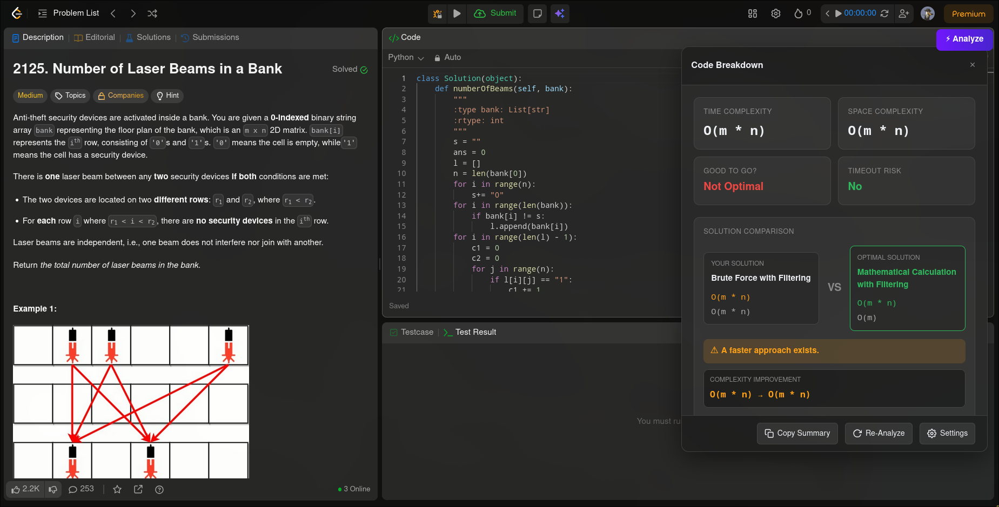
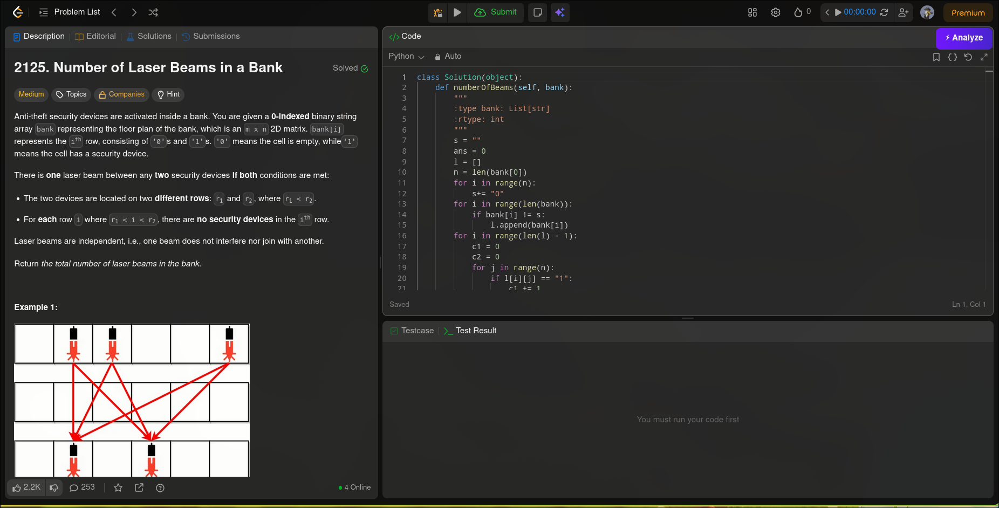
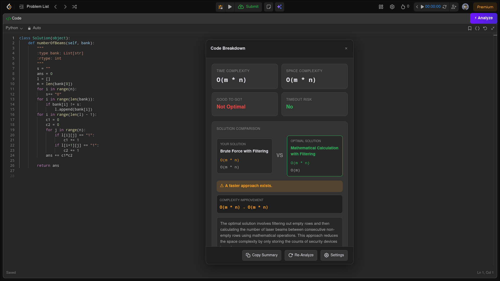

# LCA — LeetCode Complexity Analyzer

LCA is a Firefox browser extension that analyzes your LeetCode solutions using a custom Mistral AI agent and provides detailed algorithmic feedback directly inside the LeetCode interface.

The extension automatically extracts:

- Problem statement
- Constraints
- Submitted code

and sends them to a specialized AI reviewer that evaluates:

- Time complexity
- Space complexity
- Optimality
- TLE risk
- Cost breakdown
- Optimization opportunities

All results are displayed in an interactive analysis panel inside LeetCode.

---

## Quick Start

### 1. Install the extension in Firefox.

- Search "Free LeetCode TC analyzer" (might not be available currently as its still in reviewing stage)
- click on the first icon, and install it. (I'll also attach the direct link after it publishes)

### 2. Open any LeetCode problem page.

### 3.5 Get your mistral api key

- go to https://mistral.ai/ and sign in
- go to https://console.mistral.ai/home to get your api key
- click on the 'Api Keys' section on the left side vertical bar
<p align="center">
  
</p>
- Click on 'Add New API key'
<p align="center">
  
</p>

<p align="center">
  
</p>
- copy your api key

### 4. Save the API key.

- After opening any leetcode question, you will see an purple 'Analyze' button on top right.
<p align="center">
  
</p>
- clicking on that button will open settings page
- you can paste your api key at the bottom there
  <p align="center">
  
</p>
- click on save button and you are good to go

### 5. Write or paste your solution into the LeetCode editor.

### 6. Click the **Analyze** button that appears on the page.

### 7. Wait a few seconds while the AI reviews your solution.

### 8. View the generated report, including:

- Time Complexity
- Space Complexity
- Optimality Analysis
- TLE Risk Assessment
- Cost Breakdown
- Optimization Suggestions

### 9. Modify your solution and click **Reanalyze** whenever you want updated feedback.

---

## Features

### Complexity Analysis

- Big-O Time Complexity
- Big-O Space Complexity
- Exact Performance Formula
- Exact Memory Formula

### Optimality Detection

- Detects the algorithmic paradigm used
- Determines whether the solution is asymptotically optimal
- Suggests superior approaches when available

### Cost Audit

Provides a block-by-block breakdown of:

- Time contribution
- Space contribution
- Important operations

### Constraint-Aware Evaluation

Uses the problem constraints to:

- Estimate worst-case operation counts
- Evaluate TLE risk
- Highlight scalability issues

### Optimization Suggestions

Generates actionable feedback describing:

- Why the current solution is suboptimal
- Which approach is better
- What conceptual shift is required

### Integrated UI

- Floating Analyze button
- Draggable analysis window
- Resizable panel
- Collapsible sections
- Copy summary functionality
- One-click reanalysis

### Secure API Key Storage

Users provide their own Mistral API key through the extension settings page.

The key is stored locally using the browser storage API and is never hardcoded into the extension.

---

## Screenshots

### Analysis Dashboard

<h2>Screenshots</h2>
  <p align="center">
  
</p>

  <p align="center">
  
</p>


  <p align="center">
  
</p>
---

## Installation

### Firefox

1. Clone the repository:

```bash
git clone https://github.com/swan556/tc-analyzer-ext
```

2. Open Firefox.

3. Navigate to:

```
about:debugging
```

4. Select:

```
This Firefox
```

5. Click:

```
Load Temporary Add-on
```

6. Select:

```
manifest.json
```

7. The extension will now be available on LeetCode problem pages.

---

## Configuration

### Mistral API Key

1. Open the extension settings page.

2. Enter your Mistral API key.

3. Click Save.

The key will be stored locally and reused automatically.

---

## How It Works

### Content Script

The content script runs on LeetCode problem pages and:

- Extracts code from the Monaco editor
- Extracts the problem statement
- Extracts constraints
- Sends data to the background script

### Background Script

The background script:

- Retrieves the user's API key
- Sends requests to the Mistral API
- Receives the analysis response
- Returns the result to the content script

### Mistral Agent

A custom Mistral agent performs:

- Complexity analysis
- Cost auditing
- Constraint evaluation
- Optimality checking
- Optimization recommendations

### UI Layer

The analysis is rendered as an interactive dashboard directly inside LeetCode.

---

## Tech Stack

- JavaScript
- Firefox Extensions API
- Mistral AI
- HTML
- CSS

---

## Project Structure

```text
TC-ANALYZER-EXT/
├── content.js
├── background.js
├── options.html
├── options.js
├── manifest.json
└── README.md
```

---

## Future Improvements

- Chrome support
- Better operation count estimation
- Multiple AI providers
- Export reports

---

## Disclaimer

LCA is an educational tool intended to help developers understand algorithmic complexity and optimization opportunities.
AI-generated analysis may occasionally be incorrect and should be used as a learning aid rather than a definitive source of truth.
